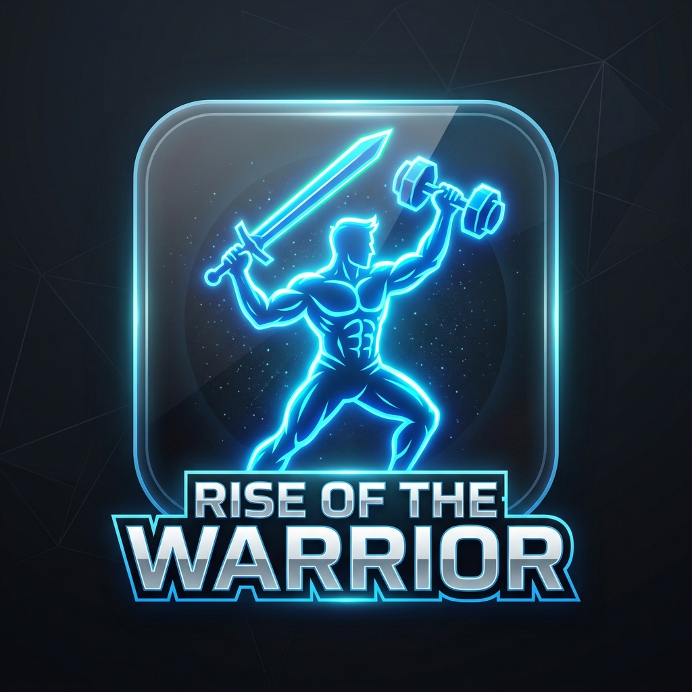

# Rise of the Warrior ⚔️🏋️‍♂️



Welcome to **Rise of the Warrior**, the ultimate real-life RPG fitness application! Turn your daily workouts into epic quests, level up your character, and build your own shadow army as you get stronger in real life. 

## Features 🚀
* **Real-Life RPG Progression**: Log your physical workouts (Push-ups, Pull-ups, Running) to earn XP, level up, and increase your in-game stats (Strength, Stamina, Speed, Defense, Mana).
* **Shadow Army Integration**: Extract the shadows of defeated enemies (after tough workouts) and build your very own Shadow Army!
* **Daily Quests & Punishments**: Complete your daily routine or face the Penalty Zone. The system will hold you accountable.
* **Fully Synced Cloud Database**: Powered by Firebase Firestore. Your stats are securely saved in the cloud and synced across all your devices instantly.
* **Google Authentication**: Seamless 1-click Google Login built directly into the app.

---

## 🛠 Project Architecture
This project is built using a modern **Monorepo** structure featuring a React Native mobile application and an Express.js backend.

- `/mobile` - The React Native & Expo mobile application frontend.
- `/backend` - The Node.js / Express backend server handling Firestore syncing and cron jobs.

---

## ⚙️ How to Setup and Run

### 1. Backend Setup
1. Open a terminal and navigate to the `backend` directory.
   ```bash
   cd backend
   npm install
   ```
2. Set up your `.env` file inside the `backend` folder. You will need your Firebase Service Account credentials.
3. Start the backend server:
   ```bash
   npm start
   ```

### 2. Mobile App Setup
1. Open a new terminal and navigate to the `mobile` directory.
   ```bash
   cd mobile
   npm install
   ```
2. Create a `.env` file in the `mobile/` directory containing your Google Web Client ID and your Backend API URL:
   ```env
   EXPO_PUBLIC_WEB_CLIENT_ID="YOUR_WEB_CLIENT_ID.apps.googleusercontent.com"
   EXPO_PUBLIC_API_URL="http://10.0.2.2:5000/api"
   ```
3. Run the app using Expo:
   ```bash
   npx expo start --clear
   ```
4. Press `a` to open on Android, or `i` to open on iOS!

---

## 🎨 Design System
The UI relies heavily on a sleek, high-contrast **glassmorphism** style with dark, neon elements (`#00F0FF`, `#13141C`) to give it a futuristic, system-like feel reminiscent of modern webtoons and litRPGs.
